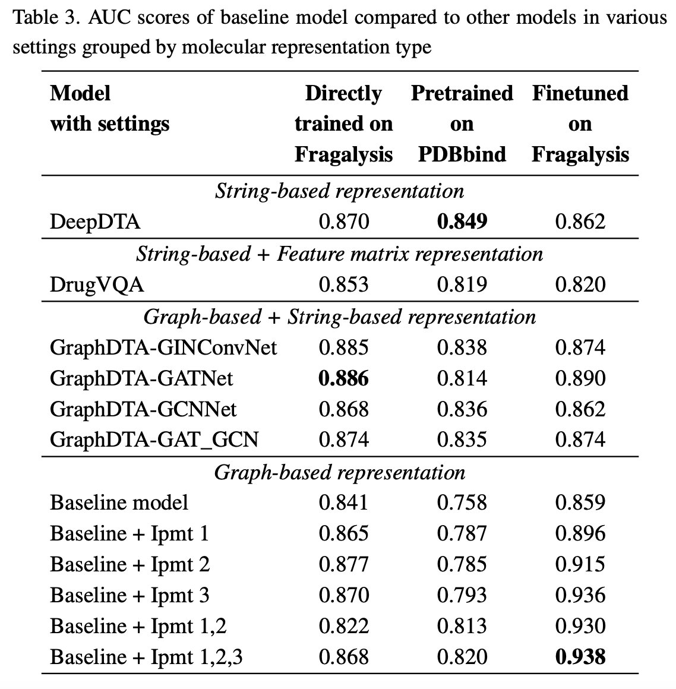

## Main Results



## Training command example

```
python train.py \
        --epoch 1000 \
        --batch_size 8 \
        --num_workers 8 \
        --dropout_rate 0.3 \
        --train_keys keys/train_IUPHAR.pkl \
        --test_keys keys/test_IUPHAR.pkl \
        --tatic static \
        --nhop 3 \
        --lr 1e-4 \
```

```
python train.py \
        --epoch 1 \
        --batch_size 8 \
        --num_workers 8 \
        --dropout_rate 0.3 \
        --train_keys keys/train_IUPHAR.pkl \
        --test_keys keys/test_neg_IUPHAR.pkl \
        --tatic static \
        --nhop 3 \
        --lr 1e-4 \
        --ckpt save/save_136.pt \
```